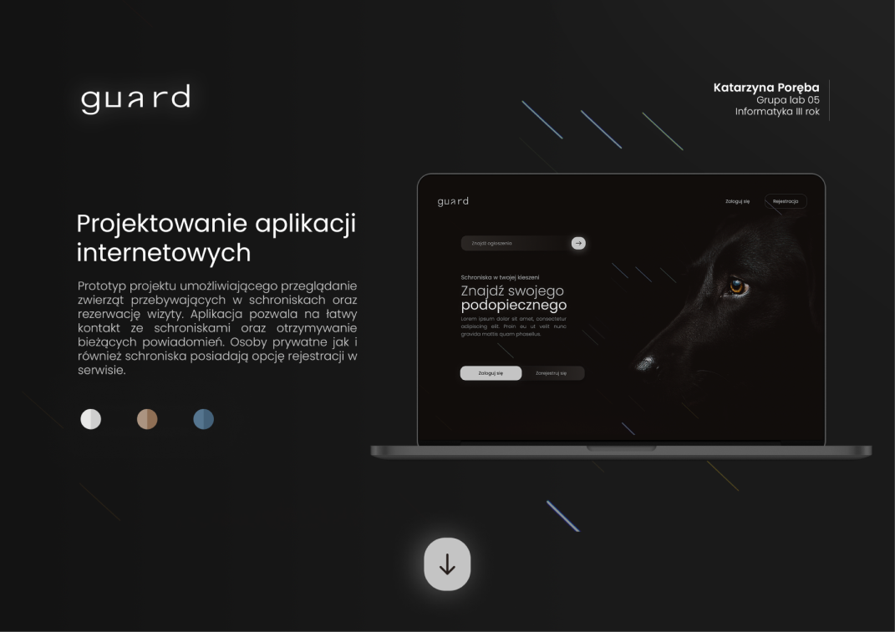
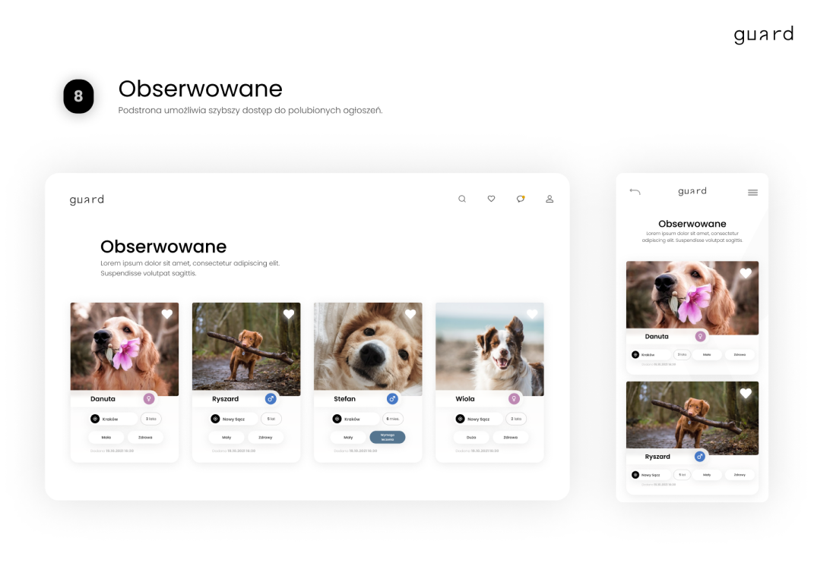

---
### Projektowanie Aplikacji Internetowych
Aplikacja **Guard** jest to serwis ułatwiający adopcję oraz przeglądanie zwierząt w schroniskach.
Umożliwia ona rejestrację oraz łatwe dodawanie ogłoszeń przez schroniska.
Opisane widoki stworzone na zajęcia z przedmiotu PAI prezentują się w następujący sposób.  

---
Niektóre widoki mogą różnić się nieznacznie od stron końcowych.  
  

---
### Spełnienie poszczególnych kryteriów ewaluacji projektu
1. **Dokumentacje w README.MD**  
Poniższa dokumentacja zapisana jest w języku Markdown.
2. **Kod napisany obiektowo (część backendowa)**  
Kod w folderze src zapisany jest obiektowo. Podzielony jest on na takie części jak: Controllers, Models, Repository.
3. **Diagram ERD**  
Poniżej znajduje się zdjęcie diagramu ERD. Diagram ten w formie pdf został zamieszczony również pod nazwą DiagrameERD.pdf.
4. **GIT**  
Nad aplikacją starałam się pracować systematycznie oraz wyniki pracy zamieszczać na repozytorium bitbucket. Stworzone są
dwie gałęzie na których rozwijany był projekt. Wersja ostateczna została również zmergowana do gałęzi master.
5. **Realizacja tematu**  
Przesłane widoki widoczne są na zdjęciach powyżej.
6. **HTML**  
Widoki zostały umieszczone w szablonach. Przykładem tego jest powtarzająca się częśc nawigacyjna, umieszczona
w pliku **nav.php** oraz **mobile.php** (jej wersja mobilna).
7. **POSTGRESQL**  
W plikach znajdujących się w katalogu src znaleźć można połączenie się z bazą PostgreSQL oraz stosowanie połączeń przez PDO.
8. **Złożoność bazy danych**  
Baza zawiera relację między tabelami.
9. **PHP**  
W projekcie użyte zostały funkcje wbudowane w PHP.
10. **Java Script**  
Język użyty do walidacji formularzy, zapytań Fetch API oraz pobierania i manipulowania elementami DOM.
11. **Fetch API**  
Zastosowanie Fetch API z użyciem metody POST oraz GET. Przetworzenie otrzymanych danych z serwera w blokach then().
12. **Design**  
Design przedstawiony jest na widokach powyżej. Stosowane w projekcie są klasy CSS.
13. **Responsywność**  
Wszystkie widoki są responsywne. Działają one pod różne urządzenia wybrane z Narzędzi Deweloperskich przeglądarki.
14. **Logowanie**  
    Proces logowania użytkowników w oparciu o bazę danych
15. **Sesja użytkownika**  
Utrzymuje sesję w oparciu o cookies oraz bazę danych.
16. **Uprawnienia użytkowników**  
Uprawnienia użytkowników są badane w trakcie działania aplikacji. Przykładem tego jest dostęp 
do widoku umożliwiającego dodanie ogłoszenia tylko dla użytkowników zarejestrowanych jako schronisko.
17. **Role użytkowników**  
Aplikacja posiada role użytkowników - Schronisko oraz standardowego usera.
18. **Wylogowywanie**  
Po wylogowywaniu następuje aktualizacja bazy danych oraz usunięcie sesji.
19. **Widoki, wyzwalacz/Funkcje, Transakcje na bazie danych**  
W aplikacji zastosowany jest widok o nazwię "Projects_DESC".
20. **Akcje na referencjach**  
W zapytaniach używane są JOINY.
21. **Bezpieczeństwo**  
Hasła są hashowane, a dostęp do zawartości dla zalogowanych użytkowników nie jest osiągalny bez autoryzacji.
22. **Brak replikacji kodu**
23. **Czystość i przejrzystość kodu**
24. **Baza danych zrzucona do pliku .SQL**

